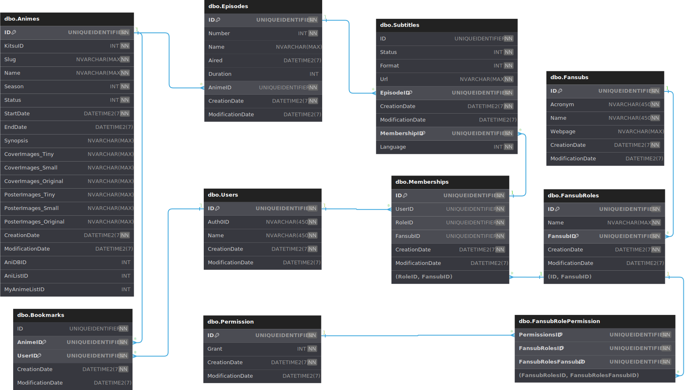

Add-Migration: dotnet-ef migrations add
Bundle-Migration  
Drop-Database  
Get-DbContext  
Get-Migration  
Optimize-DbContext  
Remove-Migration  
Scaffold-DbContext  
Script-Migration  
Update-Database: dotnet-ef database update
Revert-Migration: dtonet-ef database 'PreviousMigrationName'

